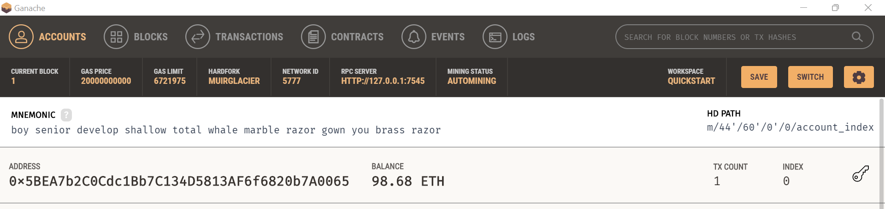
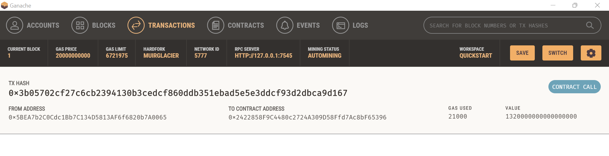
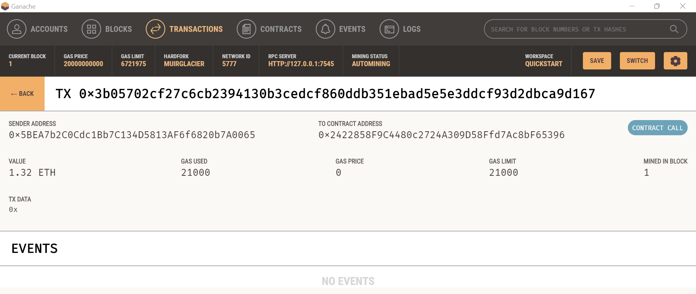

# Module19Challenge
Blockchain Wallets

In this challenge we have been tasked with integrating the Ethereum blockchain network into the application in order to enable our customers to instantly pay the hired fintech professionals with cryptocurrency.

## Usage

In the terminal navigate to the project folder that contains `.env` file and the `fintech_finder.py` and `crypto_wallet.py` files.

Ensure the conda dev environment is activated.

Using CLI, please run the Streamlit application by using 'streamlit run fintech_finder.py'.

## Transaction

One transaction was executed for fintech professional Ash. He was hired for 4 hours at hourly rate per ether of 0.33 eth. The total transaction paid was 1.32 eth. Following images of the transaction have been uploaded.

### Sender (address, balance and transaction (TX) count)

### Transaction 

### Recipient (balance and history)

## Contributors

Parag Borkar

---

© 2022 Trilogy Education Services, a 2U, Inc. brand. All Rights Reserved.
